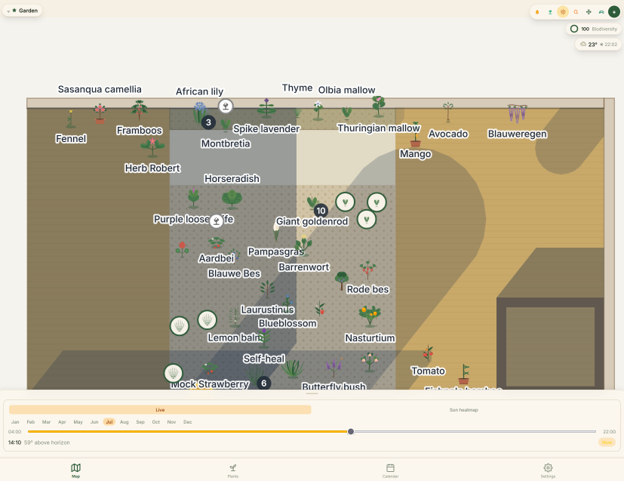
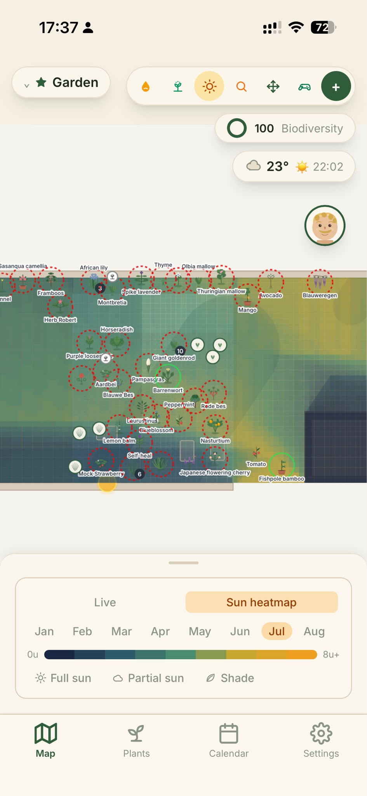
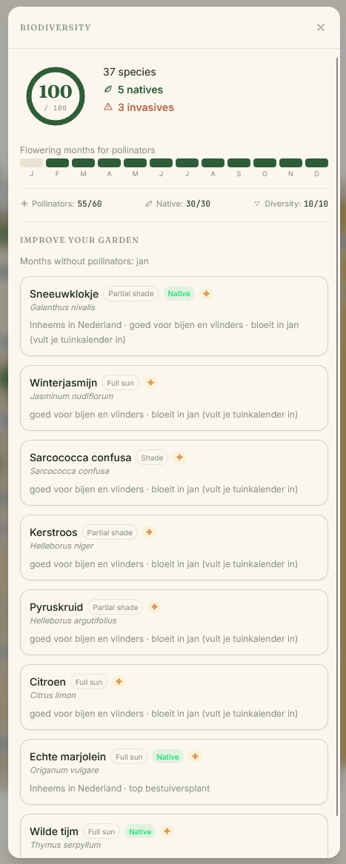
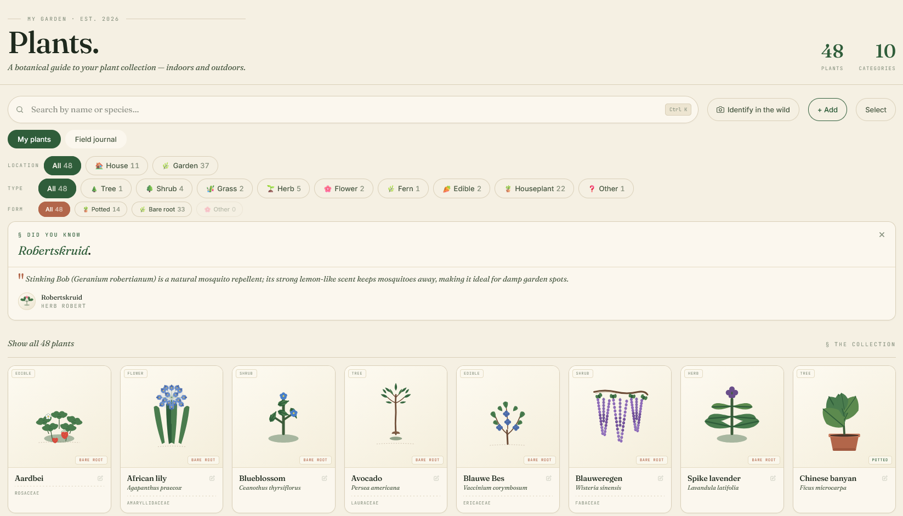

<div align="center">

# 🌿 Floreren

**A mobile-first PWA for tracking plants, logging care, and visualising your garden — sun, shadows and all.**

[](./LICENSE)




</div>

---

## What is it?

**Floreren** (Dutch for *"to flourish"*) is a plant-care app built for a household in Amsterdam to keep track of every plant — indoors and out — and never miss a watering again. It started as a two-person family tool and is being built out to support other households with their own gardens.

The thing that makes it more than a checklist: it knows **where** your plants actually stand. Draw your garden to scale, place each plant, and Floreren computes the sun's path and the shadows your fence and shed cast across the seasons — so "this corner gets three hours of afternoon sun in June" becomes something the app can tell you, not something you have to guess.

## ✨ Features

- 🗺️ **Garden & indoor maps** — draw your space to scale in a layout editor (zones, rooms, walls, doors, windows), then place plants and objects on an SVG canvas.
- ☀️ **Sun & shadow simulation** — real solar position by GPS + date, with heatmap overlays showing how much light each spot receives. Shadow casters (fences, structures) are modelled per map.
- 💧 **Smart care scheduling** — per-plant watering/fertilising/care schedules with weather-aware adjustments (rain and temperature from Open-Meteo feed into what's actually due).
- 📋 **Daily dashboard** — what needs care today, overdue counts, and a recent-activity log.
- 🔍 **Plant identification** — photo-based ID via a self-hosted BioCLIP model on GPU, with a PlantNet fallback.
- 🧠 **Species knowledge** — care thresholds, phenology, and fun facts generated and cached per species (LLM-assisted).
- 🌱 **Biodiversity scoring** — a per-garden score with native/invasive/pollinator insights and planting suggestions.
- 📸 **Photo journal** — a per-plant photo timeline stored in object storage.
- 🔔 **Notifications** — opt-in daily email digest and web-push reminders (with quiet hours).
- 🐝 **Field observations** — log wild plant/weed sightings on the map.
- 👨‍👩‍👧 **Households** — JWT auth, invite codes, multiple members per garden.

## 📸 A look inside

<table>
  <tr>
    <td width="50%" valign="top">
      
      <p align="center"><em>Seasonal sun heatmap — full sun → shade, month by month.</em></p>
    </td>
    <td width="50%" valign="top">
      
      <p align="center"><em>A per-garden biodiversity score, with native &amp; pollinator insight.</em></p>
    </td>
  </tr>
  <tr>
    <td width="50%" valign="top">
      
      <p align="center"><em>Your plant collection — filter by location, type, and form.</em></p>
    </td>
    <td width="50%" valign="top">
      
      <p align="center"><em>A care calendar: what each day asks of your garden.</em></p>
    </td>
  </tr>
</table>

## 🧱 Tech stack

| Layer | Tech |
|---|---|
| **Frontend** | React 19 · TypeScript · Vite · Tailwind CSS · Zustand |
| **PWA** | `vite-plugin-pwa` (installable, offline-aware) |
| **Backend** | FastAPI · Python · asyncpg |
| **Database** | PostgreSQL (Neon) · Alembic migrations |
| **Sun/geometry** | `suncalc` + custom coordinate/shadow math |
| **AI** | BioCLIP (image embeddings, self-hosted GPU) · LLM for care/species data · PlantNet fallback |
| **Infra** | Vercel (web) · Fly.io (API) · Cloudflare (DNS + worker tunnel) · R2 (images) |

## 🏗️ Architecture

```
┌──────────────┐     HTTPS      ┌──────────────┐     asyncpg     ┌────────────┐
│  React PWA   │ ─────────────▶ │   FastAPI    │ ──────────────▶ │  Postgres  │
│  (Vercel)    │   JWT auth     │   (Fly.io)   │                 │   (Neon)   │
└──────────────┘                └──────┬───────┘                 └────────────┘
                                       │
                        image ID       │  offload
                                       ▼
                              ┌──────────────────┐
                              │  BioCLIP worker  │  GPU, exposed via
                              │  (Cloudflare     │  a Cloudflare Tunnel
                              │   Tunnel)        │
                              └──────────────────┘
```

- **SVG is the source of truth** for map coordinates — the viewBox comes from the DB, and pointer events convert into SVG space (no manual rotation transforms).
- **Multi-tenant by household** — every data endpoint is scoped to the caller's household via the JWT.
- **Postgres-only** — the backend requires a `DATABASE_URL`; migrations run automatically on deploy.

## 🚀 Getting started

Requirements: **Node 22**, **Python 3.13**, and a PostgreSQL database (a free [Neon](https://neon.tech) branch works well).

```bash
# 1. Backend
cd backend
python -m venv .venv
source .venv/bin/activate        # Windows: .venv\Scripts\activate
pip install -r requirements.txt
cp .env.example .env             # then set DATABASE_URL (+ optional API keys)
alembic upgrade head

# 2. Frontend
cd ../frontend
npm install

# 3. Run both (from the repo root)
cd ..
npm run dev                      # frontend on :5173, API on :1415
```

> Verify frontend changes with `cd frontend && npm run build` — Vite's build is stricter than `tsc` and catches errors `tsc` misses.

## 📁 Project structure

```
frontend/src/
  pages/          # route-level screens (dashboard, plants, maps, calendar, settings)
  components/
    map/          # read-only garden/indoor map view
    editor/       # layout editor (zones, rooms, walls)
    sun/          # sun position + heatmap overlays
    sheets/       # bottom-sheet panels
  store/          # Zustand store (useFloreren)
  utils/          # coordinate math, sun calc, shadow geometry
backend/
  routers/        # FastAPI route modules
  services/       # business logic (species knowledge, garden log, …)
  database/       # asyncpg pool + FastAPI dependency
  alembic/        # schema migrations
  main.py
```

## 🤖 How it's built

Floreren is developed with an AI-assisted workflow using [Claude Code](https://claude.com/claude-code) — issues triaged in GitHub, changes verified against the real Vite build (not just `tsc`), and a backend test suite that runs on an in-memory SQLite seam so it needs no live Postgres. Contributions and ideas are welcome.

## 📄 License

Licensed under the **GNU Affero General Public License v3.0** — see [LICENSE](./LICENSE). You're free to read, learn from, and build on this code; if you run a modified version as a network service, the AGPL asks you to share those changes.

---

<div align="center">
<sub>Made with 🌱 in Amsterdam.</sub>
</div>
