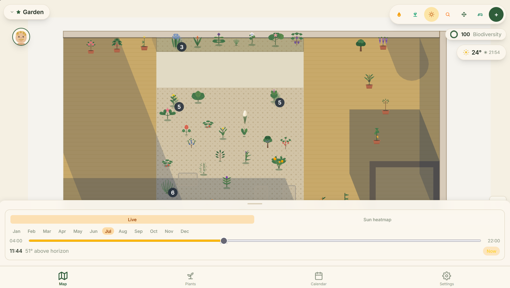
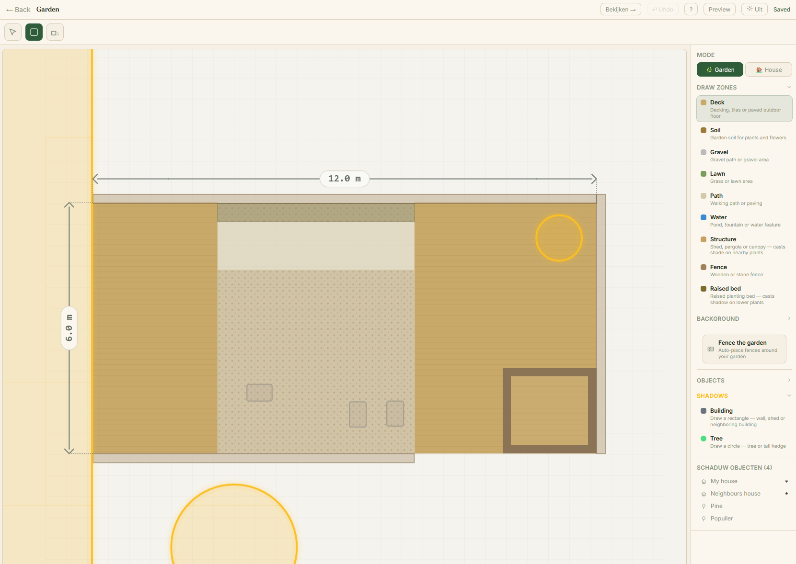
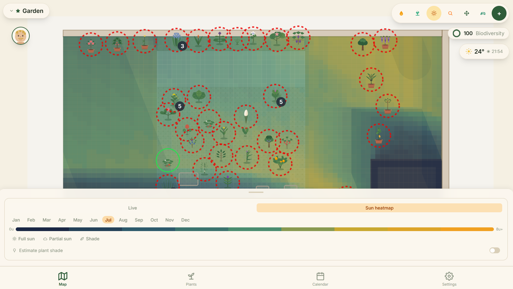
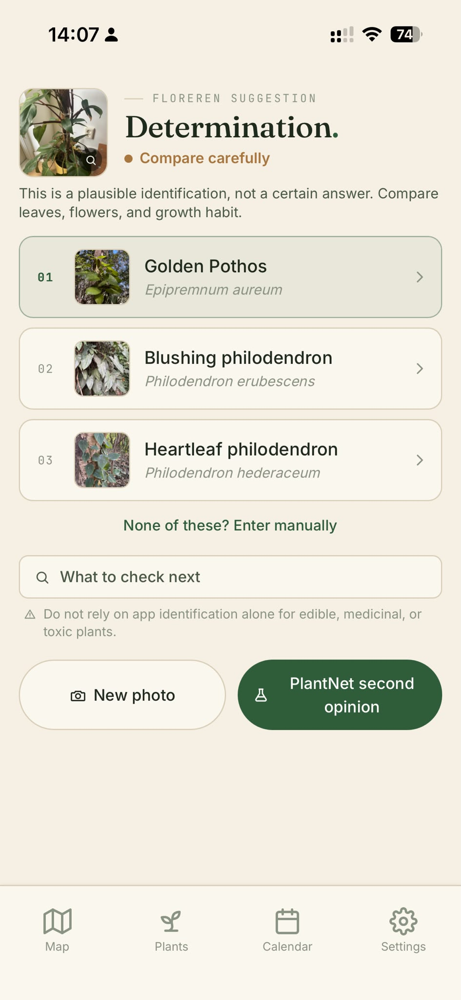
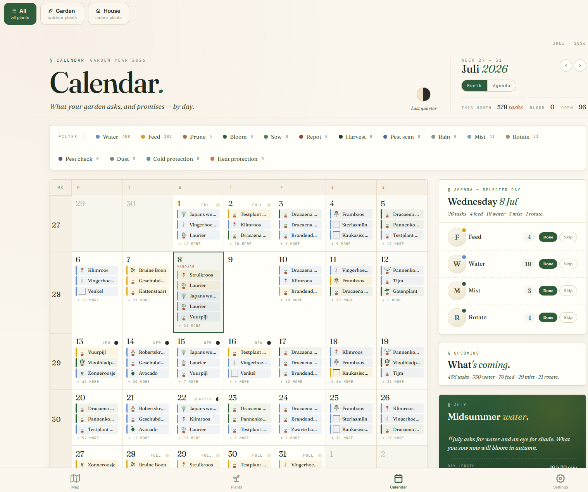
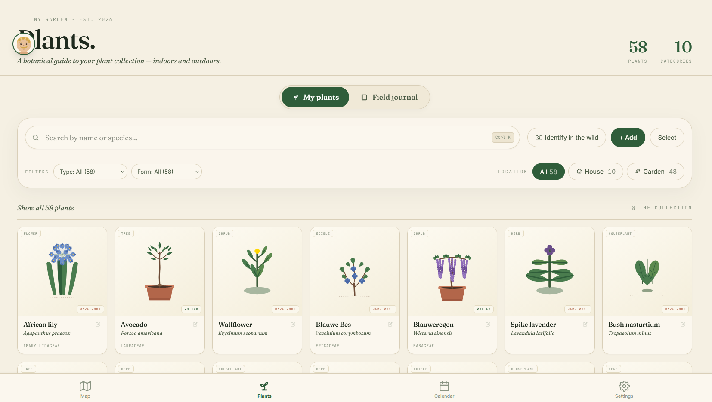
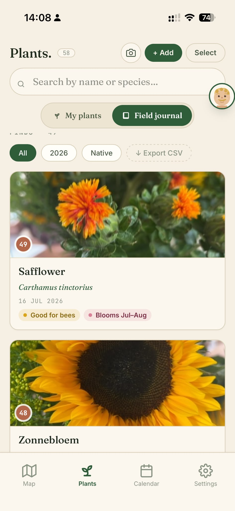

<div align="center">


# Floreren

**A free garden app built for an Amsterdam garden, and now for anyone who wants to stop guessing where to put things.**

[](./LICENSE)




</div>

---

## What is this?

Floreren (*"to flourish"* in Dutch) started because plants kept ending up in the wrong corners of an Amsterdam garden. Too much shade here, scorching sun there. Forgetting to water things, losing track of what was planted where, and every spring meant another round of guesswork.

So we built something that actually knows.

Draw your garden to scale, place each plant, and Floreren calculates the sun's path across every month of the year. So "that spot gets three hours of afternoon sun in June" stops being a hunch. It tracks watering, feeding, and growth. It reminds you what needs care today and shows you what's coming up next week.

It works as a normal web app in any browser, and as a **mobile-first PWA**. Add it to your phone's home screen and it feels native. Both are first-class experiences.

The app is **free**, with no paywalls. You can **download all your own data** (plants, photos, history) whenever you want. Calendar sync (iCal) keeps your plant care alongside the rest of your day.

## What it does

- **Garden & indoor maps**. Draw any space to scale. Outdoor gardens get GPS coordinates and a compass bearing; indoor floor plans get rooms, walls, doors, and windows. Place plants and structures exactly where they live.



- **Live sun & shadow simulation**. Real solar position based on your coordinates and the date. See exactly where shadows fall at any hour of any month. A seasonal heatmap shows how much light every square metre gets throughout the year: full sun, partial, or deep shade.



- **Plant identification**. Snap a photo of an unknown plant and get a species match. Runs BioCLIP on a local GPU, with PlantNet as a fallback for the tricky ones.



- **Smart care scheduling**. Watering and feeding schedules that know about rain and heat. Rain delays outdoor watering. Heat waves prompt earlier moisture checks for both indoor and outdoor plants. But your personal schedule stays authoritative. The app suggests, never silently rewrites.



- **Plant logbook**. A searchable collection of every plant you own, with botanical illustrations, per-plant photo timelines, care history, and field notes. Filter by location (garden vs. house), type, or growth form.





- **Biodiversity score**. A per-garden biodiversity rating based on native Dutch flora and pollinator value. Still Netherlands-only; expanding to other regions is on the roadmap.

- **iCal sync & data export**. Subscribe to your care calendar in any calendar app. Export your full plant database, photos and all, with one click. Your data, your rules.

## How it's built

React 19 + TypeScript + Tailwind on the frontend, FastAPI + Python + asyncpg on the backend, PostgreSQL on Neon. Deployed to Vercel (frontend) and Fly.io (API). The plant identification worker runs on a local GPU behind a Cloudflare tunnel.

The repo is open source under AGPL v3. Read it, learn from it, run your own instance.

## Getting started

Requirements: **Node 22**, **Python 3.13**, and a PostgreSQL database (a free [Neon](https://neon.tech) branch works great).

```bash
# 1. Backend
cd backend
python -m venv .venv
source .venv/bin/activate        # Windows: .venv\Scripts\activate
pip install -r requirements.txt
cp .env.example .env             # set DATABASE_URL + optional API keys
alembic upgrade head

# 2. Frontend
cd ../frontend
npm install

# 3. Run both (from the repo root)
cd ..
npm run dev                      # frontend on :5173, backend on :1415
```

> Verify frontend changes with `cd frontend && npm run build`. Vite's build is stricter than `tsc` and catches errors `tsc` misses.

## Project structure

```
frontend/src/
  pages/          # route-level screens
  components/
    map/          # garden/indoor map view
    editor/       # layout editor (zones, rooms, walls)
    sun/          # sun position + heatmap overlays
    sheets/       # bottom-sheet panels
  store/          # Zustand store (useFloreren)
  utils/          # coordinate math, sun calc, shadow geometry
backend/
  routers/        # FastAPI route modules
  services/       # business logic
  database/       # asyncpg pool + FastAPI dependency
  alembic/        # schema migrations
  main.py
```

## License

Licensed under the **GNU Affero General Public License v3.0**. See [LICENSE](./LICENSE). You're free to read, learn from, and build on this code; if you run a modified version as a network service, the AGPL asks you to share those changes.
