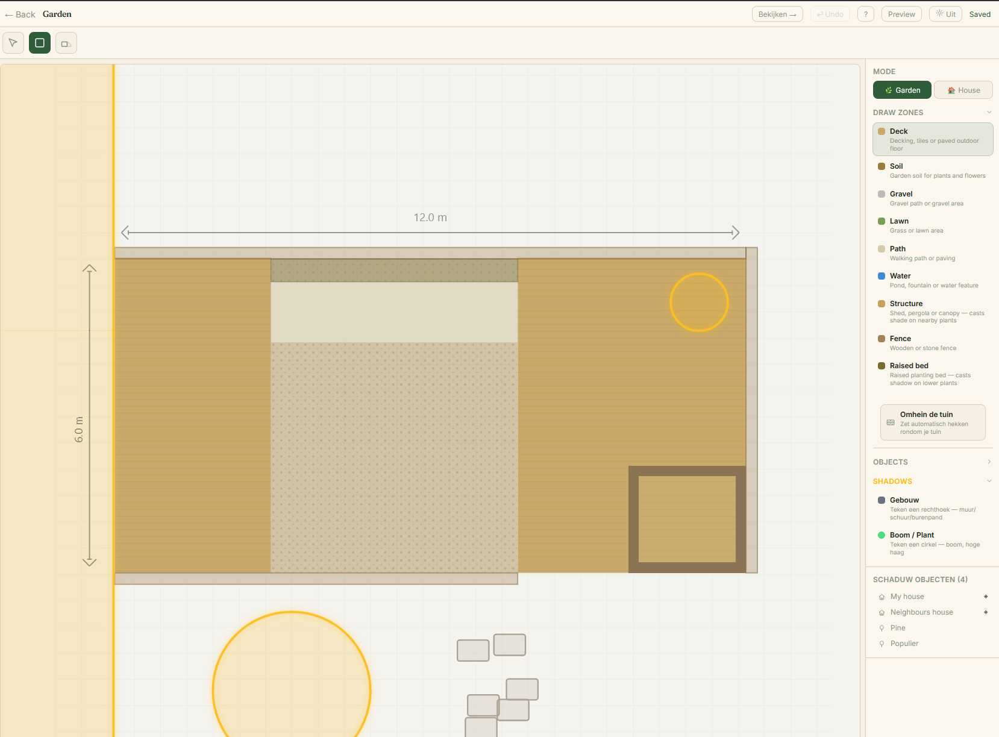

<div align="center">


# Floreren

**A plant-care app for our garden in Amsterdam — built with friends, AI, and a lot of coffee.**

[](./LICENSE)


</div>

---

## What is this?

Floreren (Dutch for *"to flourish"*) is the app we built to keep track of every plant in our garden and home in Amsterdam. My wife and I kept forgetting to water things, losing track of what we'd planted where, and guessing wrong about which corner gets afternoon sun. So we built something that actually knows.

Draw your garden to scale, place each plant, and Floreren figures out the sun's path and the shadows your fence casts — so "that corner gets three hours of sun in June" stops being a guess.

It's a **mobile-first PWA** — add it to your phone's home screen and it feels like a native app.

## What it does

- **Garden & indoor maps** — draw your space to scale, place plants and objects
- **Live sun & shadow simulation** — real solar position by GPS + date, with a heatmap showing how much light each spot gets across the seasons
- **Smart care scheduling** — watering and fertilising schedules that adapt to rain and temperature
- **Plant identification** — snap a photo, get a species match (BioCLIP on GPU, with PlantNet fallback)
- **Photo journal** — per-plant photo timeline, stored in the cloud
- **Daily email digest** — what needs care today, with quiet hours so it doesn't ping at midnight

## How it's built

Floreren is developed with [Hermes](https://hermes-agent.nousresearch.com) — an AI coding agent that switches between models (DeepSeek, Codex, Claude) depending on the task. Issues are triaged in GitHub, PRs are reviewed by a second model, and everything is verified against the real Vite production build before it ships.

The stack is React 19 + TypeScript + Tailwind on the frontend, FastAPI + Python + asyncpg on the backend, PostgreSQL on Neon, and deployments to Vercel (web) and Fly.io (API).

## A look inside

<table>
  <tr>
    <td colspan="2" valign="top">
      
      <p align="center"><em>Draw your garden to scale — zones, structures, fences, and the shadow casters that drive the sun simulation.</em></p>
    </td>
  </tr>
  <tr>
    <td width="50%" valign="top">
      
      <p align="center"><em>Seasonal sun heatmap — full sun to shade, month by month.</em></p>
    </td>
    <td width="50%" valign="top">
      
      <p align="center"><em>A per-garden biodiversity score, with native & pollinator insight.</em></p>
    </td>
  </tr>
  <tr>
    <td width="50%" valign="top">
      
      <p align="center"><em>Your plant collection — filter by location, type, and form.</em></p>
    </td>
    <td width="50%" valign="top">
      
      <p align="center"><em>A care calendar: what each day asks of your garden.</em></p>
    </td>
  </tr>
</table>

## Getting started

Requirements: **Node 22**, **Python 3.13**, and a PostgreSQL database (a free [Neon](https://neon.tech) branch works great).

```bash
# 1. Backend
cd backend
python -m venv .venv
source .venv/bin/activate        # Windows: .venv\Scripts\activate
pip install -r requirements.txt
cp .env.example .env             # set DATABASE_URL + optional API keys
alembic upgrade head

# 2. Frontend
cd ../frontend
npm install

# 3. Run both (from the repo root)
cd ..
npm run dev                      # frontend on :5173, API on :1415
```

> Verify frontend changes with `cd frontend && npm run build` — Vite's build is stricter than `tsc` and catches errors `tsc` misses.

## Project structure

```
frontend/src/
  pages/          # route-level screens
  components/
    map/          # garden/indoor map view
    editor/       # layout editor (zones, rooms, walls)
    sun/          # sun position + heatmap overlays
    sheets/       # bottom-sheet panels
  store/          # Zustand store (useFloreren)
  utils/          # coordinate math, sun calc, shadow geometry
backend/
  routers/        # FastAPI route modules
  services/       # business logic (species knowledge, garden log, …)
  database/       # asyncpg pool + FastAPI dependency
  alembic/        # schema migrations
  main.py
```

## License

Licensed under the **GNU Affero General Public License v3.0** — see [LICENSE](./LICENSE). You're free to read, learn from, and build on this code; if you run a modified version as a network service, the AGPL asks you to share those changes.

---
